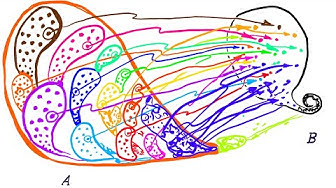

Applications
============

Thinking Behind the Axiom of Choice
-----------------------------------
Starting of simply we can think of the following definition:

**Definition:** Let :math:`A` be a non-empty set of non-empty sets. A function :math:`f:\mathcal{A} \to \bigcup_{}^{}\mathcal{A}` is called a choice function for :math:`\mathcal{A}` if :math:`f(A) \in A` for all :math:`A \in \mathcal{A}`.

In other words, a choice function for :math:`\mathcal{A}` is a function that picks an element from each set :math:`A \in \mathcal{A}`. Below are some examples of choice functions.

* Let :math:`\mathcal{A}` be the set of countries on Earth, thinking of each country as a collection of cities. Then :math:`\bigcup_{}^{} \mathcal{A}` is the set of all cities on Earth, and the function f that assigns to each country its capital city is an example of a choice function for :math:`\mathcal{A}`.
* Let :math:`\mathcal{A}` be the collection of all pairs of shoes in the world. Then the function that picks the left shoe out of each pair is a choice function for :math:`\mathcal{A}`.

Now with these examples the idea of the axiom of choice or needing some proof of it seems a bit silly. 

However, if we start to think about infinite sets or where the objects/elements in the sets are identical, then the axiom of choice becomes a bit more interesting.

As a variation of the second example above, think about: let :math:`\mathcal{A}` be the collection of all pairs of socks in the world. What is a choice function for :math:`\mathcal{A}`? Well, we can’t just pick the left sock out of each pair, because the socks in each pair are identical. So we need some other way of picking one sock out of each pair. The Axiom of Choice guarantees that there is a choice function for :math:`\mathcal{A}`, but it doesn’t tell us how to define one.

In other words, what the Axiom of Choice does is guarantee that there always exist choice functions, even in the absence of such a “rule” for defining one easily. 

Some Video Examples
-------------------
The videos below help to further explore the idea of the axiom of choice and how it can be used to prove some interesting results.

