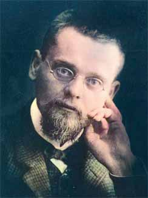

About Ernst Zermelo
===================

    Portrait of Ernst Zermelo (1871-1953)

Ernst Zermelo (1871-1953) was a German mathematician who developed and published much of foundations of math as we know it today. He is most famous for his work on set theory and the axiom of choice. 

Early Life
----------

He was born in Berlin, Germany and studied at the University of Berlin as well as Halle and Freiburg. He studied a wide range of subjects including philosophy, physics, and mathematics. At these universities he attended courses by Frobenius, Lazarus Fuchs, Planck, Schmidt, Schwarz and Edmund Husserl, all of whom are impressive mathematicians in their own right and led to Zermelo's impressive knwoledge and understanding in the field. He received his doctorate in 1894 from the University of Berlin.

The Dive into Set Theory
------------------------

When Cantor had put forward the continuum hypothesis in 1878, conjecturing that every infinite subset of the continuum is either countable (i.e. can be put in 1-1 correspondence with the natural numbers) or has the cardinality of the continuum (i.e. can be put in 1-1 correspondence with the real numbers). Hilbert's idea was that mathematicians should first work on proved every set can be well-ordered. Zermelo took up this challenge and in 1904 published a paper in which he proved that every set can be well-ordered. This was a major breakthrough in set theory and was the first of many papers Zermelo would publish on the subject.

The Axiom of Choice
-------------------
The axiom of choice is the basis for Zermelo's proof that every set can be well ordered; in fact the axiom of choice is equivalent to the well ordering property so we now know that this axiom has to be used. His proof of the well ordering property used the axiom of choice to construct sets by transfinite induction. At the time many mathematicians were sceptical of the axiom of choice and Zermelo's proof was criticised by some. They believed that the study of set theory was an legitimate area of study and not constructive to the field of math. However, Zermelo's proof was correct and the axiom of choice is now widely accepted as a valid axiom of set theory and those that criticised him also used the axiom of choice already when working with infinite sets.

Axiomatic Set Theory
--------------------
In 1908 Zermelo published his axiomatic system despite his ability to prove consistency between the axioms. He gave seven axioms:

* Axiom of extensionality
* Axiom of elementary sets
* Axiom of separation
* Power set axiom
* Union axiom
* Axiom of choice
* Axiom of infinity

Even though Zermelo was unable to prove the consistency of the original axioms, Skolem and Fraenkel independently improved Zermelo's axiom system in around 1922. The resulting system had ten axioms and is now one of the most commonly used systems for axiomatic set theory.

Quotation
----------
"...self-evidence ... must not be confused with ... provability."
