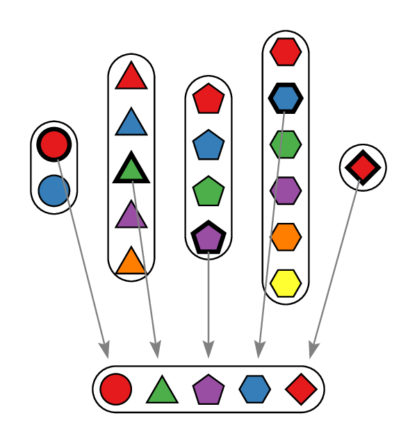

.. Final-Project documentation master file, created by
   sphinx-quickstart on Thu Nov 30 15:42:31 2023.
   You can adapt this file completely to your liking, but it should at least
   contain the root `toctree` directive.

Welcome to Axiom of Choice!
=========================================
This website is used for the final project of the course MATH 366: Real Analysis. The project is about the Axiom of Choice which was first theorized by Ernst Zermelo. We will introduce the Axiom of Choice and its equivalent statements, and then show the proof to the Axiom of Choice. We will also introduce some applications and examples of the Axiom of Choice.

   Visualization of the Axiom of Choice

.. toctree::
   :maxdepth: 2
   :caption: Contents:

   branches/Bibliography
   branches/Equivalent
   branches/Application
   branches/Proof
   branches/Question
   branches/Summary
   branches/References

